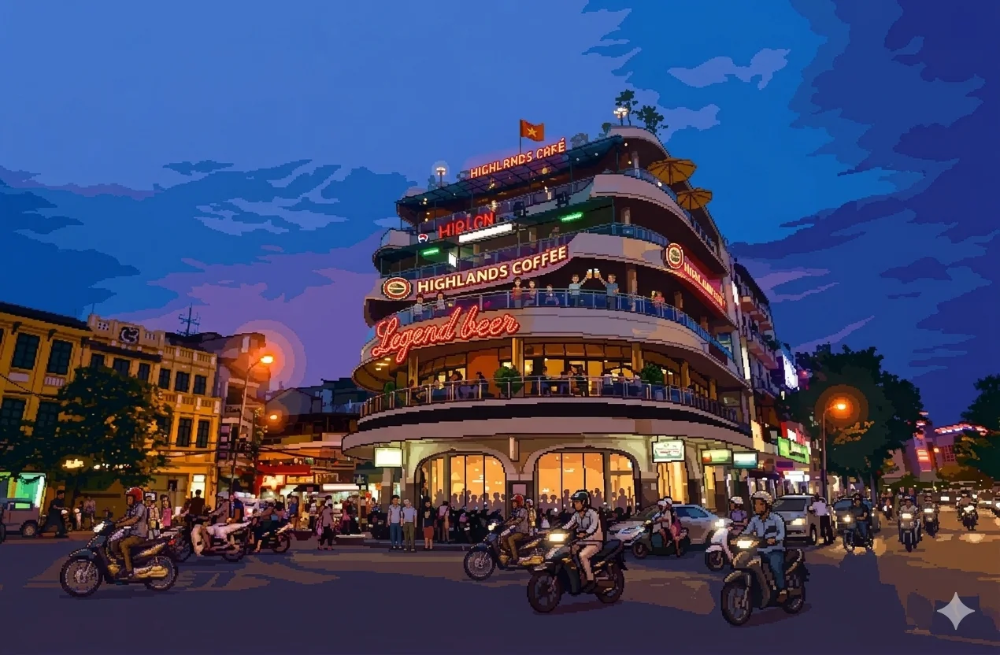

# Hà Nội Street

Xin chào! I’m Tu Nguyen, a technologist based in Hanoi working across fintech, blockchain, and climate tech.

I made this project for fun: a little pixel-art street where you can walk around, talk to the neighbors, and learn a bit about me. I enjoy games and building side projects, so turning my résumé into a neighborhood to explore felt like a fun way to introduce myself.

Take a walk, stop for a conversation, and have a look around. If you’re here for my work experience, **Read the résumé** takes you straight to it.



## How to explore

Choose **Explore the street** to enter the neighborhood, or **Read the résumé** to open the reading view directly.

- **Arrow keys or WASD:** move the character.
- **E or Enter:** talk to a nearby resident.
- **1–6:** open a résumé section while the street has keyboard focus.
- **Section buttons:** open a conversation directly.
- **Click the street:** move to the selected walkable point and interact when nearby.
- **Enter, Space, or a click on the conversation background:** reveal or advance dialogue.
- **Escape or Back to street:** close a conversation.

On touch devices, drag on the left side to move. Tap on the right to interact with a nearby resident or move to a location. The section buttons provide direct access on smaller screens.

Inside a conversation, select a chapter heading to expand its details. In the reading view, choose **Print / save PDF** to open the browser’s print dialog.

## Who to talk to

Everyone has a different part of the story:

- **The old lady — About Tu:** an introduction to me and what I do.
- **The man in blue — Experience:** the projects and teams I’ve worked on.
- **The cart girl — Education:** where I studied, plus certifications and languages.
- **The bánh mì boy — Skills & Tech:** the technologies and fields I work with.
- **The noticeboard — Contact:** where to find me online or send me an email.
- **The guys hanging out — Hobbies:** what I enjoy outside work.

A check mark appears beside each section you’ve visited during your time on the street.

## Run it locally

If you want to look under the hood, you’ll need Node.js 22.12 or later and npm. I use Node.js 24 for local development.

```sh
git clone https://github.com/vova999/Resume.git
cd Resume
npm ci
npm run dev
```

Open the local address printed by Vite, normally `http://localhost:3000`.

## Project structure

```text
index.html          Application shell, title screen, and overlays
src/
  main.js           Input, movement, dialogue content, and résumé reader
  scene.js          Canvas rendering, viewport, props, and interaction zones
  assets.js         Sprite and playable-background loading
  dialog.js         Conversation layouts, text animation, and focus handling
  editor.js         Development-only visual editing tools
  styles.css        Base scene and dialogue styles
  polish.css        Visual refinements, navigation, reader, and print styles
  resumeData.js     Legacy résumé content retained for reference
public/assets/      Artwork, sprites, and asset licenses
vite.config.js      Development server and production build configuration
```

The application uses vanilla JavaScript, HTML, CSS, and the Canvas 2D API. Vite handles development and production builds. There is no application backend or database.

## Customization

**Résumé content:** Edit `DIALOG_SEQUENCES` in `src/main.js`. Experience, education, and skills in the reading view are derived from those conversations. The reader’s introduction and hobbies summary are defined separately in the same file. Update the title and metadata in `index.html` when changing the portfolio identity.

**Contact links:** Update the board’s `hotspots` in `src/main.js`. The reading view uses those same destinations. The board artwork contains visible contact information, so update the image as well if that information changes.

**Scene layout:** Adjust `INTERACT_ZONES` and `SCENE_PROPS` in `src/scene.js`, and `WALK_ZONES` in `src/main.js`. The scene uses a 640 × 360 world coordinate system that scales to the viewport.

**Visual design:** The palette and interface refinements live in `src/polish.css`, which loads after the base stylesheet. Playable-street and sprite paths live in `src/assets.js`; ambient steam and wet-pavement animation live in `src/scene.js`.

**Visual editor:** In development, enter the street and press the backtick key to toggle the editor. Press **C** to copy the current scene values, then apply them to the corresponding source definitions. Editor changes are not automatically saved to source files. The editor is excluded from production builds.

## Build and deployment

```sh
npm run build
npm run preview
```

The build creates a `dist/` directory. The preview command serves that build locally so it can be checked before deployment.

Deploy the complete contents of `dist/` to a static hosting service. Use `npm ci && npm run build` as the build command and `dist` as the output directory.

Asset URLs currently use root-relative paths such as `/assets/...`. Deploy at the domain root. Hosting under a subdirectory requires updating those URLs as well as Vite’s base configuration.

## Verification

Before publishing changes:

- Run `npm run build` and inspect the production preview.
- Check movement, all six conversations, expandable chapters, and contact links.
- Open and close the résumé reader using both mouse and keyboard.
- Check the print preview and a narrow mobile viewport.
- Verify keyboard focus and behavior with reduced motion enabled.

There is currently no automated test suite configured.

## Say hello

You can find me on [GitHub](https://github.com/vova999) and [LinkedIn](https://www.linkedin.com/in/tu-nguyen-757026109/), or [send me an email](mailto:nguyenngoctu1112@gmail.com).

Thanks for stopping by my little corner of Hanoi.

## Asset credits and licensing

The package declares the ISC license. Artwork and bundled asset packs may carry separate terms; review the license files distributed with those assets before reusing them.
